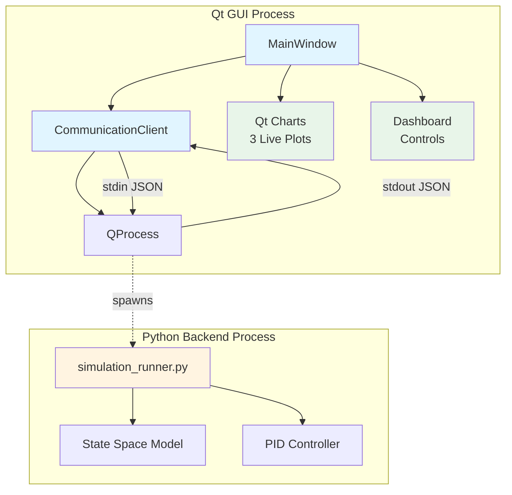

# Design Document: Qt GUI Integration

## Overview

The Qt GUI Integration feature provides a cross-platform desktop application for real-time visualization and control of an industrial pressure control system. The architecture follows a process-based separation where a Qt C++ GUI application launches and communicates with a Python simulation backend via JSON over stdout/stdin.

This design leverages Qt's QProcess for robust cross-platform process management, Qt Charts for high-performance plotting, and a simple text-based protocol for loose coupling between components. The system is designed to handle 10 Hz data updates with smooth scrolling plots and responsive user controls.

### Key Design Decisions

1. **Process-based architecture**: Using QProcess instead of network sockets provides simpler deployment, better security, and automatic process lifecycle management
2. **JSON protocol**: Text-based JSON provides debuggability, language independence, and easy extensibility
3. **Stdout/stdin communication**: Standard streams are universally supported and require no additional dependencies
4. **Qt Charts**: Native Qt plotting provides hardware-accelerated rendering and consistent cross-platform behavior
5. **Frozen backend constraint**: The GUI acts as a thin integration layer, never modifying validated simulation code

## Architecture



### Component Responsibilities

**MainWindow (Qt C++)**
- Creates and manages the three plot widgets
- Builds the dashboard UI with controls and status displays
- Connects signals from CommunicationClient to update plots and dashboard
- Handles user interactions (button clicks, gain adjustments)
- Manages UI state transitions (enabled/disabled buttons)

**CommunicationClient (Qt C++)**
- Manages the QProcess lifecycle (start, stop, error handling)
- Parses JSON from Python stdout and emits dataUpdated signals
- Serializes PID gain updates to JSON and writes to Python stdin
- Implements cross-platform Python executable detection
- Provides error reporting through connectionError signal

**simulation_runner.py (Python)**
- Loads the frozen state-space model and PID controller
- Runs closed-loop simulation with numerical integration
- Outputs JSON data points to stdout at 100ms intervals
- Reads JSON gain updates from stdin (non-blocking)
- Rebuilds closed-loop system matrices when gains change

## Components and Interfaces

### CommunicationClient Interface

```cpp
class CommunicationClient : public QObject {
    Q_OBJECT
public:
    void start(const QString& scriptPath);
    void stop();
    void sendGains(double Kp, double Ki, double Kd);

signals:
    void dataUpdated(double pressure, double valveAngle, 
                     double motorCurrent, double setpoint, double timestamp);
    void connectionError(const QString& errorMessage);

private slots:
    void onReadyRead();
    void onProcessError(QProcess::ProcessError error);

private:
    QProcess* m_pythonProcess;
};
```

**Key Methods:**
- `start()`: Attempts to launch Python with "python" then "python3", waits 2s for startup
- `stop()`: Sends SIGKILL to Python process, waits 3s for termination
- `sendGains()`: Serializes gains to JSON, appends newline, writes to stdin
- `onReadyRead()`: Reads complete lines from stdout, parses JSON, emits dataUpdated
- `onProcessError()`: Maps QProcess errors to user-friendly messages

### MainWindow Interface

```cpp
class MainWindow : public QMainWindow {
    Q_OBJECT
public:
    explicit MainWindow(QWidget *parent = nullptr);

public slots:
    void onDataUpdated(double pressure, double valveAngle, 
                       double motorCurrent, double setpoint, double timestamp);

private slots:
    void onStartClicked();
    void onStopClicked();
    void onResetClicked();
    void onApplyGainsClicked();
    void onConnectionError(const QString& error);

private:
    void setupUI();
    void setupPlots();
    void setupDashboard();
    QChartView* createChart(const QString& title, const QString& yLabel,
                            QLineSeries* series, QLineSeries* referenceSeries);

    CommunicationClient* m_client;
    QLineSeries* m_pressureSeries;
    QLineSeries* m_setpointSeries;
    QLineSeries* m_valveAngleSeries;
    QLineSeries* m_motorCurrentSeries;
    double m_timeWindow;  // 15.0 seconds
};
```

**Key Methods:**
- `onDataUpdated()`: Appends new points, removes old points, updates axes, updates dashboard
- `onStartClicked()`: Constructs absolute path to simulation_runner.py, calls client->start()
- `onResetClicked()`: Stops simulation, clears all series, waits 500ms, restarts
- `createChart()`: Factory method for creating QChartView with configured axes and styling

### Python Backend Interface

**Output Format (stdout):**
```json
{"pressure": 245.67, "valve_angle": 45.23, "motor_current": 8.91, "setpoint": 500.0, "timestamp": 12.34}
```

**Input Format (stdin):**
```json
{"Kp": 115.2, "Ki": 34.56, "Kd": 49.92}
```

**SimulationRunner Class:**
```python
class SimulationRunner:
    def __init__(self, setpoint=500.0)
    def rebuild_closed_loop()
    def dynamics(state, t)
    def step()
    def get_output_data()
    def update_gains(Kp, Ki, Kd)
    def check_stdin()
    def run()
```

## Data Models

### Data Point Structure

The fundamental data structure exchanged between Python and Qt:

```cpp
struct DataPoint {
    double pressure;       // bar (0-700 range)
    double valveAngle;     // degrees (0-180 range)
    double motorCurrent;   // amperes (0-25 range)
    double setpoint;       // bar (constant 500.0)
    double timestamp;      // seconds (monotonically increasing)
};
```

### Plot Data Management

Each plot maintains a QLineSeries with time-value pairs:

```cpp
// Data structure (implicit in QLineSeries)
struct PlotPoint {
    double x;  // timestamp (seconds)
    double y;  // measured value (pressure, angle, or current)
};
```

**Scrolling Window Algorithm:**
1. Append new point: `series->append(timestamp, value)`
2. Remove old points: `while (first_point.x < timestamp - 15.0) series->remove(0)`
3. Update X axis: `axis->setRange(timestamp - 15.0, timestamp)` when `timestamp > 15.0`

### State Management

**GUI State Machine:**
```
IDLE (Start enabled, Stop/Reset disabled)
  |
  | Start clicked
  v
RUNNING (Start disabled, Stop/Reset enabled)
  |
  | Stop clicked OR Error
  v
IDLE
```

**Python State:**
```python
state = [i_a, omega_m, theta_m, P, x_int]  # 5-element numpy array
t = 0.0  # simulation time
last_output_time = 0.0  # last time data was output
```

## Correctness Properties

*A property is a characteristic or behavior that should hold true across all valid executions of a system—essentially, a formal statement about what the system should do. Properties serve as the bridge between human-readable specifications and machine-verifiable correctness guarantees.*


### Property 1: Data Point Time Window Management

*For any* sequence of data points with timestamps, after adding a new point and removing old points, all remaining points in the plot should have timestamps within 15 seconds of the most recent timestamp.

**Validates: Requirements 1.4**

### Property 2: Python Executable Detection with Fallback

*For any* list of Python executable candidates (e.g., ["python", "python3"]), the system should attempt each candidate in order until one successfully starts, or report failure if none succeed.

**Validates: Requirements 2.2**

### Property 3: Path Resolution Correctness

*For any* valid executable directory structure following the project layout (gui/build/ or gui/build/Release/), navigating up two directories and appending "simulation_runner.py" should produce a valid absolute path to the script.

**Validates: Requirements 2.3**

### Property 4: JSON Round-Trip for Data Points

*For any* valid simulation state (pressure, valve_angle, motor_current, setpoint, timestamp), serializing to JSON and then parsing should recover all five fields with their original values.

**Validates: Requirements 3.1, 3.2**

### Property 5: JSON Serialization for Gain Updates

*For any* three PID gain values (Kp, Ki, Kd), serializing them to JSON should produce a valid JSON object containing all three gains with correct field names and values.

**Validates: Requirements 3.4**

### Property 6: Error Calculation Correctness

*For any* pressure value and setpoint value, the calculated error should equal (setpoint - pressure) and be formatted to 2 decimal places.

**Validates: Requirements 5.1**

### Property 7: Status Determination Based on Error Threshold

*For any* pressure error value, the status should be "STABLE" (green) when the absolute error is ≤ 25 bar, and "WARNING" (red) when the absolute error > 25 bar.

**Validates: Requirements 5.2, 5.3**

## Error Handling

### Process Lifecycle Errors

**Python Not Found:**
- Detection: QProcess::FailedToStart after trying both "python" and "python3"
- Response: Emit connectionError with message: "Python not found. Please install Python 3.9+ and ensure it is in your system PATH."
- UI State: Re-enable Start button, keep Stop/Reset disabled

**Script Not Found:**
- Detection: QFile::exists() returns false for constructed script path
- Response: Show QMessageBox with path and instruction to verify project structure
- UI State: Do not launch process, keep Start button enabled

**Process Crashed:**
- Detection: QProcess::Crashed error
- Response: Emit connectionError with message: "Python process crashed"
- UI State: Re-enable Start button, disable Stop/Reset

### Communication Errors

**Malformed JSON:**
- Detection: QJsonDocument::fromJson() returns null document
- Response: Log warning with qWarning(), skip the line, continue processing
- UI State: No change, continue normal operation

**Missing JSON Fields:**
- Detection: QJsonObject::contains() returns false for required field
- Response: Log warning with qWarning(), skip the data point, continue processing
- UI State: No change, continue normal operation

**Write Error:**
- Detection: QProcess::WriteError
- Response: Emit connectionError with message: "Write error to Python process"
- UI State: May need to restart process

### Platform-Specific Handling

**Windows stdin checking:**
- Use msvcrt.kbhit() instead of select.select()
- Handle the fact that Windows doesn't support select() on stdin

**Unix stdin checking:**
- Use select.select() with 0 timeout for non-blocking check
- Standard POSIX behavior

## Testing Strategy

### Unit Testing Approach

Given the nature of this GUI integration feature, traditional unit testing has limited applicability. The system is primarily composed of:
- Qt GUI components (best tested through integration)
- Process communication (requires actual process spawning)
- Real-time plotting (requires Qt event loop)

**Unit tests should focus on:**
1. JSON serialization/deserialization functions (Property 4, 5)
2. Error calculation logic (Property 6)
3. Status determination logic (Property 7)
4. Path resolution logic (Property 3)

**Example unit tests:**
```cpp
TEST(JsonSerialization, GainUpdateFormat) {
    // Test that gain serialization produces correct JSON
    QJsonObject json = serializeGains(115.2, 34.56, 49.92);
    EXPECT_EQ(json["Kp"].toDouble(), 115.2);
    EXPECT_EQ(json["Ki"].toDouble(), 34.56);
    EXPECT_EQ(json["Kd"].toDouble(), 49.92);
}

TEST(ErrorCalculation, CorrectFormula) {
    double error = calculateError(500.0, 475.0);
    EXPECT_NEAR(error, 25.0, 0.01);
}

TEST(StatusDetermination, ThresholdBoundary) {
    EXPECT_EQ(determineStatus(25.0), "STABLE");
    EXPECT_EQ(determineStatus(25.01), "WARNING");
    EXPECT_EQ(determineStatus(-25.0), "STABLE");
    EXPECT_EQ(determineStatus(-25.01), "WARNING");
}
```

### Property-Based Testing Approach

Property-based testing is challenging for this feature due to:
- Heavy reliance on Qt GUI framework
- Process communication requiring actual subprocess
- Real-time plotting requiring event loop
- Platform-specific behavior

**Properties that CAN be tested:**
- Property 4: JSON round-trip (can generate random data points)
- Property 5: Gain serialization (can generate random gain values)
- Property 6: Error calculation (can generate random pressure values)
- Property 7: Status determination (can generate random error values)

**Properties that are DIFFICULT to test with PBT:**
- Property 1: Requires Qt event loop and QLineSeries
- Property 2: Requires actual process spawning
- Property 3: Requires file system operations

**Recommendation:** Focus property-based tests on pure functions (JSON, calculations) and use integration tests for GUI and process communication.

**Example property test (pseudocode):**
```cpp
PROPERTY_TEST(JsonRoundTrip, DataPoints) {
    // Generate random data point
    double pressure = random(0, 700);
    double valveAngle = random(0, 180);
    double motorCurrent = random(0, 25);
    double setpoint = 500.0;
    double timestamp = random(0, 1000);
    
    // Serialize to JSON
    QString json = serializeDataPoint(pressure, valveAngle, motorCurrent, 
                                      setpoint, timestamp);
    
    // Parse back
    DataPoint parsed = parseDataPoint(json);
    
    // Verify round-trip
    EXPECT_NEAR(parsed.pressure, pressure, 0.001);
    EXPECT_NEAR(parsed.valveAngle, valveAngle, 0.001);
    EXPECT_NEAR(parsed.motorCurrent, motorCurrent, 0.001);
    EXPECT_NEAR(parsed.setpoint, setpoint, 0.001);
    EXPECT_NEAR(parsed.timestamp, timestamp, 0.001);
}
```

### Integration Testing Approach

**Integration tests are the primary testing strategy for this feature.**

**Critical integration test scenarios:**
1. **End-to-end simulation**: Start GUI, launch Python, verify data flows, stop simulation
2. **Gain update flow**: Start simulation, modify gains, verify Python receives updates
3. **Reset functionality**: Start simulation, let it run, reset, verify clean restart
4. **Error handling**: Test with missing Python, missing script, malformed JSON
5. **Cross-platform**: Run on Windows, Linux, macOS to verify path resolution and process spawning
6. **Plot scrolling**: Run for >15 seconds, verify old data is removed
7. **UI state transitions**: Verify button enable/disable states through lifecycle

**Integration test framework:**
- Use Qt Test framework for GUI testing
- Use QSignalSpy to verify signals are emitted correctly
- Use QTest::qWait() for timing-dependent tests
- Mock Python process for some tests, use real process for others

### Manual Testing Checklist

Given the real-time, visual nature of the application, manual testing is essential:

1. **Visual verification:**
   - [ ] All three plots display correctly
   - [ ] Colors match specification (blue, green, orange, red dashed)
   - [ ] Plots scroll smoothly without jumps
   - [ ] LCD display updates in real-time
   - [ ] Status indicator changes color appropriately

2. **Cross-platform verification:**
   - [ ] Test on Windows 10/11
   - [ ] Test on Ubuntu 20.04/22.04
   - [ ] Test on macOS 12+
   - [ ] Verify Python detection works on each platform
   - [ ] Verify path resolution works on each platform

3. **Error scenario verification:**
   - [ ] Test with Python not installed
   - [ ] Test with simulation_runner.py moved
   - [ ] Test with corrupted Python script
   - [ ] Verify error messages are user-friendly

4. **Performance verification:**
   - [ ] Monitor CPU usage (should be <10% on modern hardware)
   - [ ] Verify 100ms update rate is maintained
   - [ ] Run for extended period (>5 minutes) to check for memory leaks
   - [ ] Verify no lag or stuttering in plots

### Test Configuration

**Property-based tests:**
- Minimum 100 iterations per property test
- Tag format: `Feature: qt-gui-integration, Property {number}: {property_text}`
- Use appropriate random generators for each data type

**Integration tests:**
- Use Qt Test framework
- Run with both Qt5 and Qt6 where possible
- Include timeout handling (tests should not hang)

**Build verification:**
- Test with CMake 3.16, 3.20, 3.25+
- Test with Qt 5.15 and Qt 6.5+
- Test with C++17 and C++20 compilers
