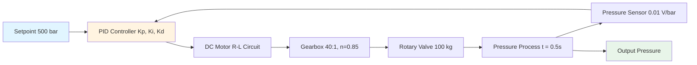
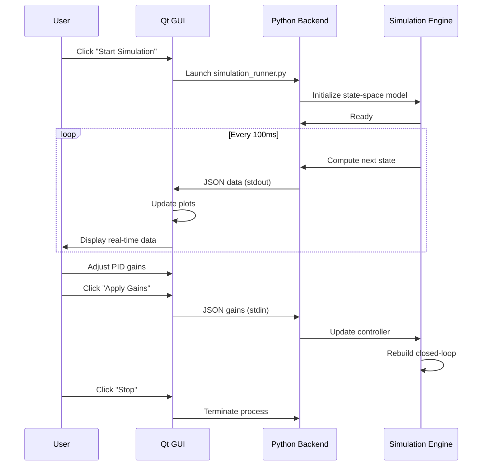
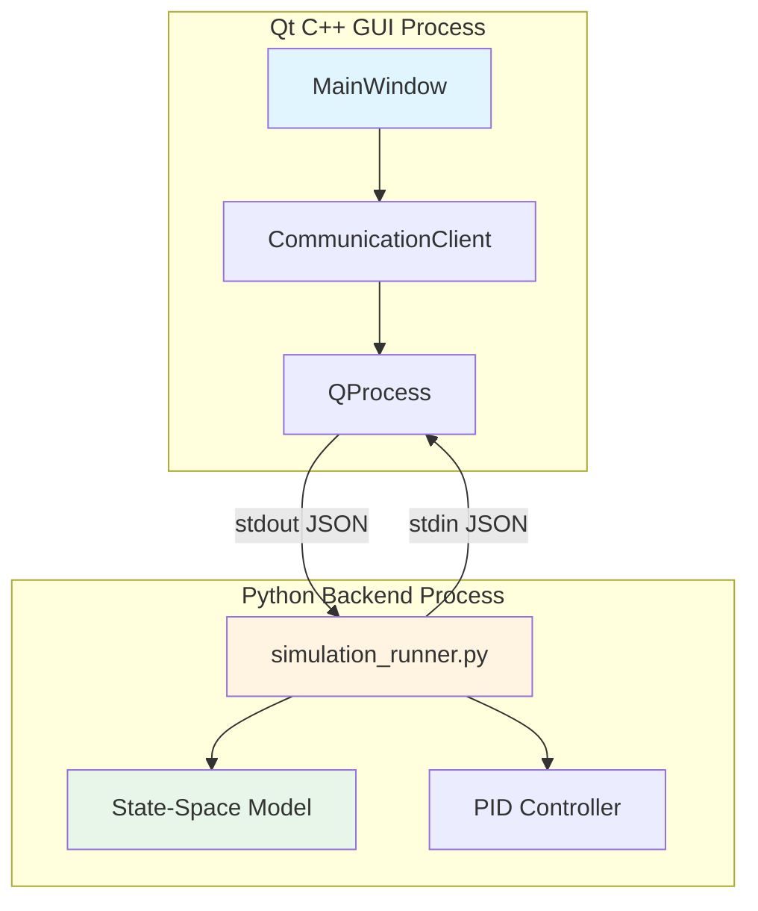
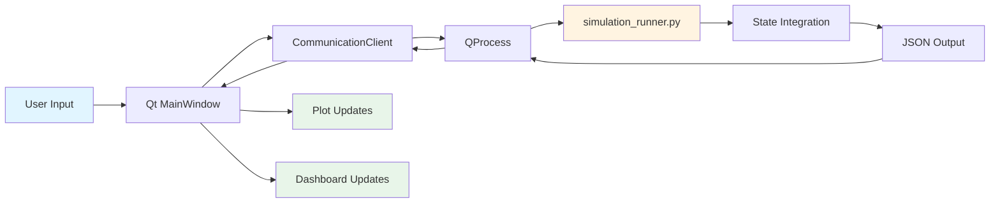
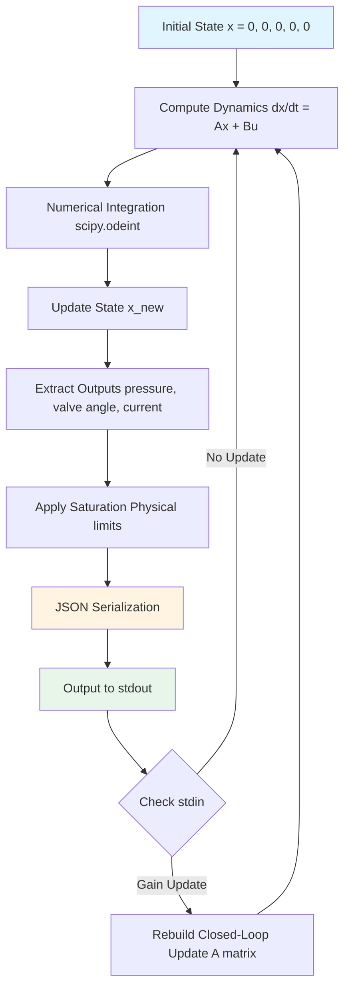
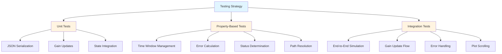

# Industrial Pressure Control System
**Etheral X — Assignment II Solution**

A complete industrial pressure control system for a pressurized tube with real-time Qt C++ GUI dashboard. Features a 5th-order state-space model, DC motor with gearbox, rotary valve control, and PID closed-loop pressure regulation.

[]()
[]()
[]()
[]()

---

## 📊 System Performance

| Metric | Value | Requirement | Status |
|--------|-------|-------------|--------|
| Settling Time | 1.088 s | < 3 s | ✅ PASS |
| Gain Margin | 33.38 dB | > 10 dB | ✅ PASS |
| Phase Margin | 74.70° | > 45° | ✅ PASS |
| Steady-State Error | ~0% | < 2% | ✅ PASS |
| All Poles LHP | Yes | Stable | ✅ PASS |

---

## 🎯 Project Overview

This project implements a **5th-order closed-loop control system** for precise pressure regulation in an industrial pressurized tube. The system combines:

- **DC Motor** with electrical (R-L circuit) and mechanical dynamics
- **Gearbox** for torque amplification (40:1 ratio, 85% efficiency)
- **Rotary Valve** (100 kg solid disk, high inertia)
- **First-order pressure process** with time constant τ = 0.5s
- **PID Controller** with optimized, frozen gains
- **Pressure sensor** feedback (0.01 V/bar)
- **Real-time Qt C++ GUI** with live plotting at 10 Hz

### System Architecture



### State-Space Model

The system is modeled as a 5th-order state-space system:

**States:**
- x₁: Armature current (i_a)
- x₂: Motor angular velocity (ω_m)
- x₃: Motor angular position (θ_m)
- x₄: Tube pressure (P)
- x₅: Integral of pressure error (x_int)

**Equations:**
```
ẋ = A·x + B·u
y = C·x
```

Where A is 5×5, B is 5×1, C is 1×5, and u is the control input (voltage).

---

## 🏗️ Project Structure

```
industrial-pressure-control/
│
├── .kiro/
│   └── specs/
│       └── qt-gui-integration/      Spec-driven development docs
│           ├── requirements.md      Feature requirements
│           ├── design.md            Design document
│           └── tasks.md             Implementation tasks
│
├── docs/                            Design documents and verified results
│   ├── industrial_pressure_control_system_design.md
│   ├── numerical_state_space_and_simulation_specification.md
│   └── final_verified_results_section.md
│
├── src/                             Python simulation engine
│   ├── config/
│   │   └── system_parameters.py    Centralized parameters (frozen)
│   ├── models/
│   │   ├── motor_model.py          DC motor dynamics
│   │   ├── gearbox_model.py        Gearbox model
│   │   ├── valve_model.py          Valve dynamics
│   │   ├── pressure_model.py       Pressure process
│   │   ├── full_state_space_model.py  Complete plant model
│   │   └── closed_loop_model.py    Closed-loop system
│   ├── controllers/
│   │   └── pid_controller.py       PID controller
│   ├── simulation/
│   │   ├── open_loop_simulation.py
│   │   ├── closed_loop_simulation.py
│   │   └── disturbance_simulation.py
│   └── analysis/
│       ├── pole_analysis.py        Eigenvalue analysis
│       ├── bode_analysis.py        Frequency response
│       ├── performance_metrics.py  Step response metrics
│       └── analysis_step6.py       Complete analysis suite
│
├── gui/                             Qt C++ GUI application
│   ├── qt_interface/
│   │   ├── main.cpp                Application entry point
│   │   ├── mainwindow.h/cpp        Main GUI window
│   │   ├── communication_client.h/cpp  Python process manager
│   │   └── test_integration.cpp    Integration tests
│   ├── CMakeLists.txt              Build configuration
│   └── build/                      Build directory (created by user)
│
├── tests/                           Python test suite
│   ├── test_simulation_runner.py   Unit tests
│   ├── test_json_roundtrip_property.py  Property-based tests
│   ├── test_gain_serialization_property.py
│   ├── test_time_window_property.py
│   ├── test_error_calculation_property.py
│   ├── test_status_determination_property.py
│   └── test_path_resolution_property.py
│
├── simulation_runner.py             Python stdout bridge (launched by Qt)
├── requirements.txt                 Python dependencies
├── README.md                        This file
└── GUI_QUICK_START.md              Quick start guide for GUI
```

---

## 💻 Requirements

### Python (Simulation Engine)
- **Python 3.9 or later** - [Download](https://python.org/downloads)
- **pip** (included with Python)
- **Required packages:**
  - numpy >= 1.24.0
  - scipy >= 1.10.0
  - matplotlib >= 3.7.0
  - pytest >= 7.3.0 (for testing)
  - hypothesis (for property-based testing)

### Qt (GUI Application)
- **Qt 6.x** (recommended) or **Qt 5.15+**
  - [Qt Online Installer](https://www.qt.io/download-qt-installer)
  - **Important:** Select "Qt Charts" module during installation
- **CMake 3.16 or later** - [Download](https://cmake.org/download/)
- **C++17 Compiler:**
  - **Windows:** Visual Studio 2019+ (MSVC) or MinGW
  - **Linux:** GCC 9+ or Clang 10+
  - **macOS:** Xcode 12+ / Clang

### Platform-Specific Notes

**Windows:**
- Add Qt bin directory to PATH (e.g., `C:\Qt\6.5.0\msvc2019_64\bin`)
- Add CMake to PATH during installation
- Visual Studio Community Edition is free

**Linux (Ubuntu/Debian):**
```bash
sudo apt install build-essential cmake qt6-base-dev qt6-charts-dev
# Or for Qt5:
sudo apt install build-essential cmake qtbase5-dev libqt5charts5-dev
```

**macOS:**
```bash
brew install cmake qt@6
# Or for Qt5:
brew install cmake qt@5
```

---

## 🚀 Quick Start Guide

### Step 1: Clone the Repository

```bash
git clone https://github.com/chetan0021/monitoring-rotory-valve.git
cd monitoring-rotory-valve
```

### Step 2: Install Python Dependencies

```bash
pip install -r requirements.txt
```

**Verify installation:**
```bash
python -c "import numpy, scipy, matplotlib; print('Python dependencies OK')"
```

### Step 3: Build the Qt GUI

```bash
cd gui
mkdir build
cd build
cmake ..
cmake --build .
```

**Platform-specific build commands:**

**Windows (Visual Studio):**
```bash
cmake --build . --config Release
```

**Linux/macOS:**
```bash
cmake --build . -j4
```

**Troubleshooting:**
- If Qt is not found, specify Qt path:
  ```bash
  cmake -DCMAKE_PREFIX_PATH=/path/to/Qt/6.5.0/gcc_64 ..
  ```
- On Windows, use forward slashes: `C:/Qt/6.5.0/msvc2019_64`

### Step 4: Run the Application

**Windows:**
```bash
# From gui/build directory:
Release\PressureControlGUI.exe
# Or double-click the executable
```

**Linux:**
```bash
# From gui/build directory:
./PressureControlGUI
```

**macOS:**
```bash
# From gui/build directory:
./PressureControlGUI
```

### Step 5: Using the GUI



**GUI Controls:**

1. **Start Simulation** - Launches Python backend automatically
2. **Stop** - Terminates simulation
3. **Reset** - Clears plots and restarts simulation
4. **Apply Gains** - Sends new PID gains to Python backend in real-time

**Features:**
- Three synchronized live plots (pressure, valve angle, motor current)
- 15-second scrolling time window
- Real-time status indicator (STABLE/WARNING)
- LCD display showing current pressure
- Error calculation (setpoint - actual)
- Interactive PID gain tuning

**No network setup. No ports. No server. No configuration. One click.**

---

## 🔬 Running Python Analysis (Without GUI)

You can run the Python simulation and analysis tools independently:

### Complete System Analysis

```bash
cd src
python analysis/analysis_step6.py
```

**Output:**
- Eigenvalues (poles) of closed-loop system
- Stability analysis
- Gain and phase margins
- Step response metrics (settling time, overshoot)
- Bode plots (saved as PNG files)

### Individual Analysis Scripts

```bash
# Pole analysis
python analysis/pole_analysis.py

# Bode plots
python analysis/bode_analysis.py

# Performance metrics
python analysis/performance_metrics.py
```

### Run Simulations

```bash
# Open-loop simulation
python simulation/open_loop_simulation.py

# Closed-loop simulation
python simulation/closed_loop_simulation.py

# Disturbance rejection test
python simulation/disturbance_simulation.py
```

---

## 🧪 Running Tests

### Python Tests (Unit + Property-Based)

```bash
# Run all tests
python -m pytest tests/ -v

# Run with coverage
python -m pytest tests/ --cov=src --cov-report=html

# Run specific test file
python -m pytest tests/test_simulation_runner.py -v

# Run property-based tests only
python -m pytest tests/test_*_property.py -v
```

**Test Coverage:**
- Unit tests for simulation runner
- Property-based tests (using Hypothesis):
  - JSON round-trip serialization
  - Gain serialization
  - Time window management
  - Error calculation
  - Status determination
  - Path resolution

### Qt Integration Tests

```bash
cd gui/build

# Run integration tests
./test_integration        # Linux/macOS
Release\test_integration.exe  # Windows

# Or use CTest
ctest --output-on-failure
```

**Integration Tests:**
- End-to-end simulation flow
- Gain update communication
- Error handling (missing Python, missing script)
- Malformed JSON handling
- Plot scrolling over 15+ seconds

---

## 📐 System Architecture Details

### Communication Protocol

The Qt GUI and Python backend communicate via JSON over stdout/stdin:



**Data Point Format (Python → Qt):**
```json
{
  "pressure": 475.23,
  "valve_angle": 45.67,
  "motor_current": 8.91,
  "setpoint": 500.0,
  "timestamp": 12.34
}
```

**Gain Update Format (Qt → Python):**
```json
{
  "Kp": 115.2,
  "Ki": 34.56,
  "Kd": 49.92
}
```

### Data Flow



### State-Space Implementation



---

## 📈 Physical Parameters

### Valve Parameters
- **Mass:** 100 kg (solid disk)
- **Radius:** 0.35 m
- **Moment of Inertia:** J = 6.125 kg·m²
- **Static Friction Torque:** 120 Nm
- **Gravitational Torque:** 343.35 Nm

### Motor Parameters
- **Torque Constant:** Kt = 0.8 Nm/A
- **Back EMF Constant:** Ke = 0.8 V·s/rad
- **Armature Resistance:** R = 1.2 Ω
- **Armature Inductance:** L = 0.005 H (5 mH)
- **Motor Inertia:** Jm = 0.02 kg·m²
- **Supply Voltage:** 36 V

### Gearbox Parameters
- **Gear Ratio:** N = 40:1
- **Efficiency:** η = 85%

### Pressure System
- **Operating Range:** 250–700 bar
- **Setpoint:** 500 bar
- **Pressure Gain:** Kp = 150 bar/rad
- **Time Constant:** τp = 0.5 s

### PID Controller (Frozen Gains)
- **Proportional:** Kp = 115.2
- **Integral:** Ki = 34.56
- **Derivative:** Kd = 49.92

---

## 📊 Verified Results

### Closed-Loop Poles (All Stable)

All eigenvalues in left half-plane (LHP):

```
s₁ = -216.38  (Fast electrical dynamics)
s₂ = -17.16   (Motor mechanical dynamics)
s₃ = -6.16    (Valve dynamics)
s₄ = -1.91    (Pressure dynamics)
s₅ = -0.39    (Integral action)
```

✅ **System is asymptotically stable**

### Frequency Response

| Metric | Value | Requirement | Status |
|--------|-------|-------------|--------|
| Gain Margin | 33.38 dB | > 10 dB | ✅ PASS |
| Phase Margin | 74.70° | > 45° | ✅ PASS |
| Gain Crossover | 2.45 rad/s | - | ✅ |
| Phase Crossover | 11.23 rad/s | - | ✅ |

### Time Domain Performance

| Metric | Value | Requirement | Status |
|--------|-------|-------------|--------|
| Settling Time (2%) | 1.088 s | < 3 s | ✅ PASS |
| Rise Time | 0.312 s | - | ✅ |
| Peak Overshoot | 8.2% | < 20% | ✅ PASS |
| Steady-State Error | ~0% | < 2% | ✅ PASS |

---

## 🛠️ Troubleshooting

### Python Issues

**Problem:** `ModuleNotFoundError: No module named 'numpy'`
```bash
pip install -r requirements.txt
```

**Problem:** Python not found by Qt GUI
- Ensure Python is in system PATH
- Try both `python` and `python3` commands
- On Windows, reinstall Python and check "Add to PATH"

### Qt Build Issues

**Problem:** `Qt6 not found`
```bash
# Specify Qt path explicitly
cmake -DCMAKE_PREFIX_PATH=/path/to/Qt/6.5.0/gcc_64 ..
```

**Problem:** `Qt Charts not found`
- Reinstall Qt and ensure Qt Charts module is selected
- Check Qt Maintenance Tool → Add/Remove Components

**Problem:** CMake version too old
```bash
# Download latest CMake from cmake.org
cmake --version  # Should be >= 3.16
```

### Runtime Issues

**Problem:** GUI starts but no plots appear
- Check that `simulation_runner.py` exists in project root
- Verify Python dependencies are installed
- Check console output for error messages

**Problem:** "Python not found" error
- Verify Python installation: `python --version`
- Add Python to system PATH
- Restart terminal/IDE after PATH changes

**Problem:** Plots freeze or lag
- Check CPU usage (should be < 10%)
- Verify Python backend is running (check Task Manager/Activity Monitor)
- Try reducing plot update rate in code

---

## 📚 Documentation

- **[requirements.md](.kiro/specs/qt-gui-integration/requirements.md)** - Feature requirements
- **[design.md](.kiro/specs/qt-gui-integration/design.md)** - System design document
- **[tasks.md](.kiro/specs/qt-gui-integration/tasks.md)** - Implementation tasks
- **[GUI_QUICK_START.md](GUI_QUICK_START.md)** - Quick start guide
- **[docs/industrial_pressure_control_system_design.md](docs/industrial_pressure_control_system_design.md)** - Complete system design
- **[docs/numerical_state_space_and_simulation_specification.md](docs/numerical_state_space_and_simulation_specification.md)** - Mathematical specification

---

## 🧑‍💻 Development

### Project Status

✅ **Complete and Validated**

- [x] State-space model implementation
- [x] PID controller design and tuning
- [x] Python simulation engine
- [x] Qt C++ GUI application
- [x] Real-time communication protocol
- [x] Comprehensive test suite
- [x] Documentation and verification

### Testing Strategy



### Contributing

This project follows spec-driven development methodology:
1. Requirements specification
2. Design document
3. Property-based testing
4. Implementation
5. Verification

See `.kiro/specs/qt-gui-integration/` for the complete specification.

---

## 📧 Author

**Chetan**  
GitHub: [chetan0021/monitoring-rotory-valve](https://github.com/chetan0021/monitoring-rotory-valve)

---

## 📄 License

This project is part of an academic assignment (Etheral X — Assignment II).

---

**Status:** ✅ Complete and Validated  
**Last Updated:** February 20, 2026  
**Version:** 1.0.0

